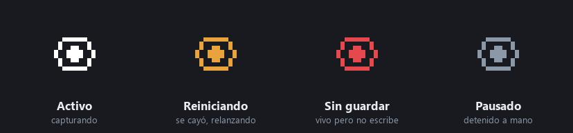

# Bitácora automática de actividad

Registra en qué trabajas durante el día sin que tengas que anotarlo, y al cerrar la jornada te manda un resumen escrito a tu bitácora de Obsidian y a tu DM de Slack.

## Cómo funciona

```
Cada minuto
     │
     ▼
Ventana activa (Windows API)  ──►  app + título + segundos sin teclado
     │                              sin capturas de pantalla, sin API, sin costo
     ▼
SQLite local
     │
     ▼
A las 6:00 am — cierre de jornada
     │
     ├─► Reporte HTML  ──►  correo
     │
     └─► Una llamada a Claude  ──►  resumen narrativo
                                         │
                                         ├─► nota de Obsidian del día
                                         └─► DM de Slack
```

El título de ventana identifica app, documento y hasta cliente sin modelo de por medio: `Campañas - LealUp - Google Ads - Google Chrome` dice más que cualquier clasificación automática, y no cuesta nada. La IA entra una sola vez al día, para redactar.

---

## Flujo completo

### Estado visible en la bandeja

El ícono cambia de color según lo que esté pasando, para que un tracker caído no se vea igual que uno sano.



### Jornada de 6 a 6

El día natural parte el trabajo real: una sesión de 22:00 a 02:00 caería en dos reportes y ninguno la describiría. La jornada va de las 06:00 a las 05:59 del día siguiente, etiquetada con la fecha en que empezó. Se ajusta con `DAY_CUTOFF_HOUR`.

### Resumen al cierre

El resumen se escribe entre marcadores propios dentro de la nota del día, así que convive con lo que ya viva ahí de otras fuentes sin pisarlo:

```markdown
## ⏱️ Tiempo por actividad
<!-- screen-tracker:inicio -->
🕐 1h 10min registrados · ⚡ 1h 10min de tiempo activo (100%)

📝 Casi todo el bloque de código ocurrió dentro del workspace
   `google-ads-assistant-bot` (≈37 min), repartido entre documentos distintos.

⚡ 70 min de actividad continua, pero muy fragmentados: 20 ventanas distintas
   y solo una superó los 10 minutos seguidos.
<!-- screen-tracker:fin -->
```

---

## Setup

```bash
cp .env.example .env   # llenar las claves
npm install
npm run tray           # bandeja + captura
```

Para que arranque sola con Windows, la versión empaquetada se registra por su cuenta al instalarse:

```bash
npm run build:win      # genera el instalador en dist/
```

## Comandos

| Comando | Qué hace |
|---|---|
| `npm run tray` | Bandeja del sistema con la captura corriendo |
| `npm start` | Solo la captura, sin bandeja |
| `npm run report` | Reporte de la jornada en curso |
| `node src/report.js 2026-09-24` | Reporte de una jornada concreta |
| `node src/daily-summary.js 2026-09-24` | Resumen narrativo a Obsidian y Slack |

## Variables de entorno

| Variable | Descripción |
|---|---|
| `CAPTURE_MODE` | `window` (título de ventana, sin costo) o `vision` (captura de pantalla + modelo) |
| `CAPTURE_INTERVAL_MINUTES` | Minutos entre capturas (default: `5`) |
| `IDLE_THRESHOLD_SECONDS` | Sin teclado ni ratón por este tiempo, cuenta como inactivo (default: `120`) |
| `DAY_CUTOFF_HOUR` | Hora de corte de la jornada (default: `6`) |
| `MAX_GAP_MINUTES` | Hueco máximo que se cuenta como trabajo; más allá, la máquina estaba suspendida (default: `5`) |
| `REPORT_HOUR` | Hora del cierre de jornada (default: `18`) |
| `OBSIDIAN_VAULT_PATH` | Carpeta del vault donde vive `Resumen YYYY-MM-DD.md` |
| `SLACK_BOT_TOKEN` | Con el token, el resumen llega al DM personal; sin él, al canal del webhook |
| `SLACK_USER_ID` | Usuario que recibe el DM |
| `SLACK_WEBHOOK_URL` | Alternativa al token, publica en el canal del webhook |
| `ANTHROPIC_API_KEY` | Solo si se usa `CAPTURE_MODE=vision` |
| `ANALYSIS_MODEL` | Modelo para el modo visión (default: `claude-haiku-4-5`) |
| `EMAIL_USER` / `EMAIL_PASS` / `EMAIL_TO` | Envío del reporte HTML por correo |
| `DB_PATH` | Base SQLite (default: `./data/tracker.db`) |

## Los dos motores de captura

| | `window` | `vision` |
|---|---|---|
| Qué lee | Título de ventana y proceso | Captura de pantalla analizada por un modelo |
| Costo | Cero | Una llamada por captura |
| Precisión de la app | Exacta, nombre canónico | Texto libre, se fragmenta en variantes |
| Identifica cliente | Sí, si el título lo trae | Rara vez |
| Ve contenido | No | Sí |

El campo `source` distingue el origen de cada fila, porque `productive` significa cosas distintas en cada uno: en `window` es que hubo teclado o ratón, en `vision` era el juicio del modelo. Sumarlos sin distinguir daría números falsos.

## Privacidad

No se guarda ninguna imagen. El modo `window` ni siquiera toma una: lee el título de la ventana y ya. El modo `vision` escribía el jpg, lo mandaba a la API y lo borraba en la misma operación. Todo vive en una base SQLite local.

---

## Tech stack

- **Node.js (ESM)** — captura programada y orquestación
- **PowerShell + Win32 API** — ventana en primer plano y tiempo sin teclado
- **SQLite** (`node-sqlite3-wasm`) — almacenamiento local
- **Electron** — bandeja del sistema con supervisión del proceso
- **electron-builder** — instalador para Windows con arranque automático
- **Claude Code en modo headless** — una llamada al día para redactar el resumen
- **Slack Web API** — entrega del resumen al DM
- **Nodemailer** — reporte HTML por correo
